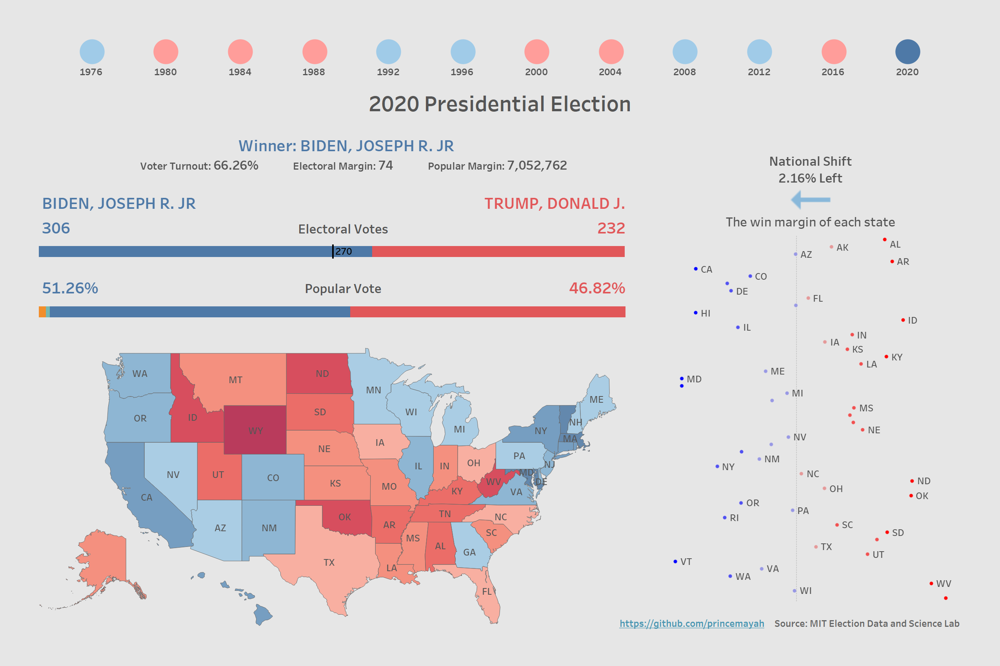
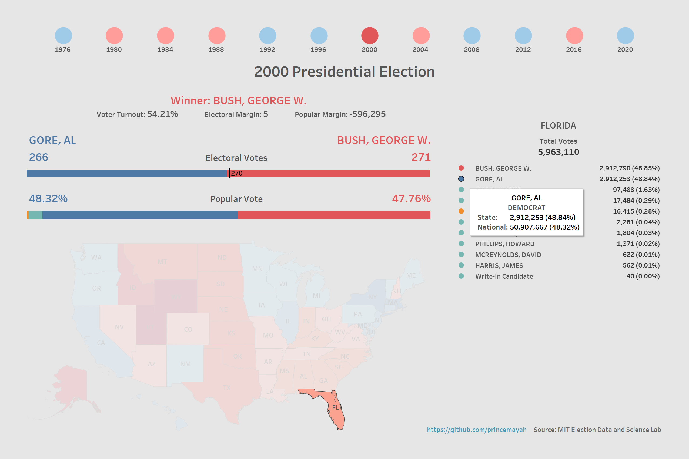
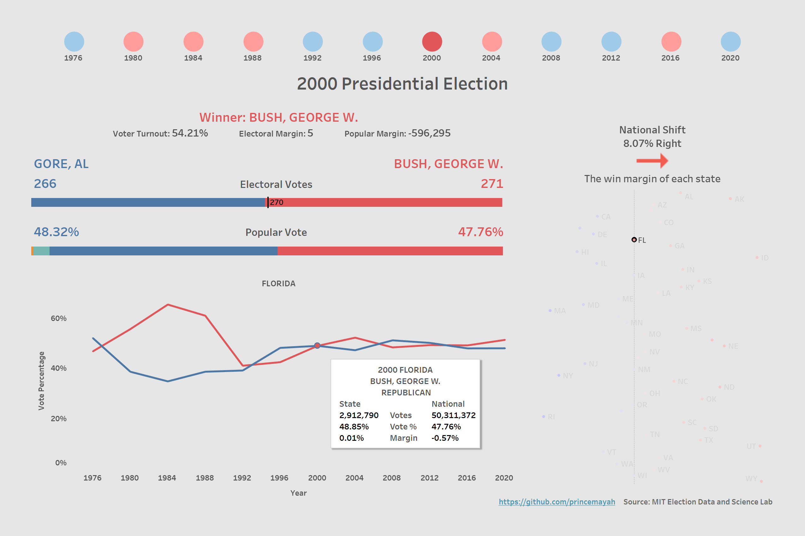

# Historical United States Presidential Election Results

This is an interactive dashboard that provides a detailed visualization of historical U.S. presidential election results from 1976 to 2020. The data for these visualizations was cleaned using Excel VBA to ensure accuracy and reliability in the analysis.

## Table of Contents
- [Project Overview](#project-overview)
- [Features](#features)
- [Data Sources](#data-sources)
- [Data Preparation in Excel](#data-preparation-in-excel)
- [Visualization](#visualization)

## Project Overview
This dashboard is a visualization of historical election data from 1976 to 2020. The aim is to simplify the analysis of election results and emphasize key metrics such as electoral outcomes, voter turnout, and trends across different election years. It is designed to help quickly understand the dynamics of U.S. presidential elections and observe how voter preferences have evolved over time.

## Features
- Interactive maps to explore the electoral outcomes by state.
- Historical comparison of voting trends over the years.
- Detailed breakdowns of key battleground states.

## Data Sources
- MIT Election Data and Science Lab
- Additional election data collected from various verified sources.

## Data Preparation in Excel
The Excel macros provided perform a series of data cleaning, transformation, and summarization tasks to prepare the election data for analysis and visualization:
- **Cleaning**: Standardizes candidate names and categorizes detailed party affiliations.
- **InStateRank**: Ranks candidates based on votes within states.
- **CandidateVotesYear**: Aggregates total votes per candidate per year.
- **TotalVotesYear**: Computes total votes per year.
- **CalculatePercentages**: Calculates the percentage of votes each candidate received in each state.
- **CalculateWinMargin**: Determines the winning margin for each state.
- **ElectoralCollege**: Maps electoral college votes to candidates.
- **VoterPopulation**: Associates voter population data with election years.
- **FixName**: Corrects specific formatting issues with candidate names.

## Visualization
[View Dashboard](https://public.tableau.com/app/profile/prince.mayah/viz/HistoricalUnitedStatesPresidentialElectionResults/Dashboard)

 

 

 
